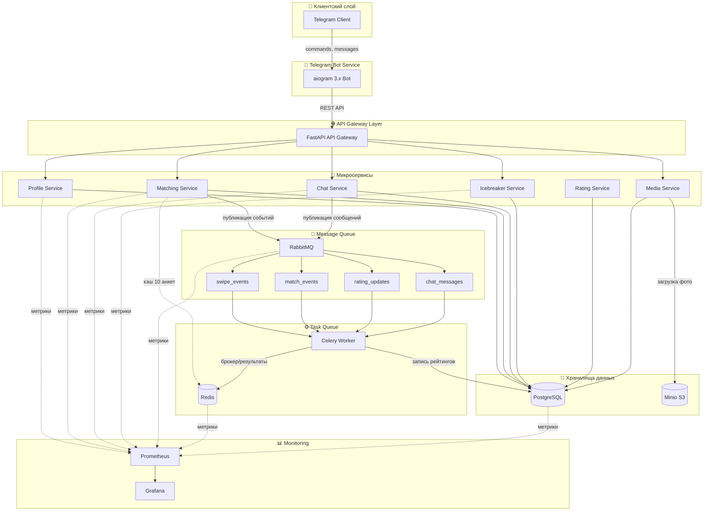
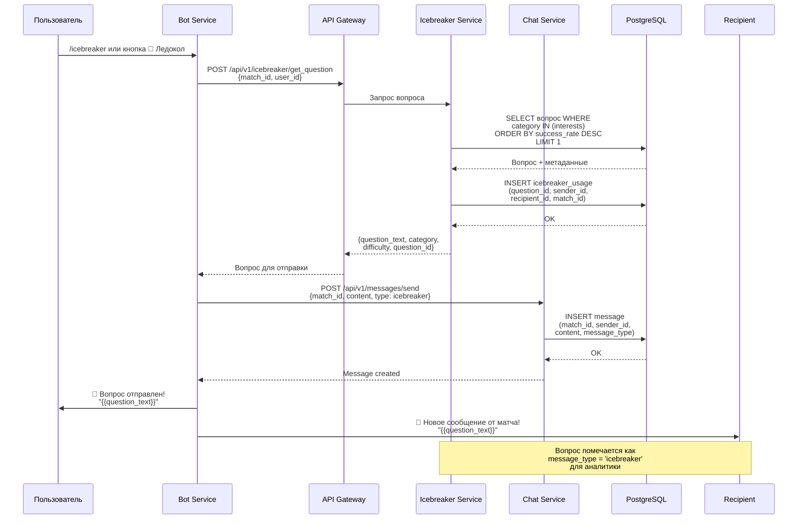

# ConnectMe — Архитектура системы

## Общая схема архитектуры



---

## Описание компонентов

### 1. Telegram Bot Service
- **Технология:** aiogram 3.x
- **Роль:** Единственный интерфейс для пользователей
- **Режим работы:** Long-polling или Webhook
- **Взаимодействие:** REST запросы к API Gateway

### 2. API Gateway (Backend API)
- **Технология:** FastAPI
- **Роль:** Единая точка входа, аутентификация, маршрутизация
- **Порт:** 8000
- **Взаимодействие:** Оркестрация запросов к микросервисам

### 3. Profile Service
- **Технология:** FastAPI + PostgreSQL
- **Роль:** CRUD профилей пользователей
- **Порт:** 8001
- **Данные:** users, profiles, photos

### 4. Matching Service
- **Технология:** FastAPI + Redis + PostgreSQL
- **Роль:** Подбор и ранжирование анкет, свайпы, мэтчи
- **Порт:** 8002
- **Кэширование:** 10 анкет на сессию в Redis
- **Данные:** swipes, matches

### 5. Chat Service
- **Технология:** FastAPI + WebSocket
- **Роль:** Обмен сообщениями между мэтчами
- **Порт:** 8003
- **Данные:** messages

### 6. Icebreaker Service
- **Технология:** FastAPI + PostgreSQL
- **Роль:** Генерация вопросов для начала разговора
- **Порт:** 8004
- **Данные:** icebreaker_questions, icebreaker_usage

### 7. Rating Service
- **Технология:** Celery + PostgreSQL
- **Роль:** Расчёт многоуровневых рейтингов
- **Порт:** N/A (worker)
- **Данные:** ratings

### 8. Media Service
- **Технология:** FastAPI + Minio
- **Роль:** Загрузка и хранение фотографий
- **Порт:** 8005
- **Хранилище:** Minio S3

### 9. PostgreSQL
- **Роль:** Основное хранилище данных
- **Порт:** 5432
- **Расширения:** PostGIS для гео-запросов

### 10. Redis
- **Роль:** Кэш сессий, брокер Celery
- **Порт:** 6379
- **TTL кэша:** 3600 секунд

### 11. RabbitMQ
- **Роль:** Асинхронная обработка событий
- **Порт:** 5672 (AMQP), 15672 (Management)
- **Exchanges:** swipe_events, match_events, rating_updates, chat_messages

### 12. Celery Worker
- **Роль:** Фоновые задачи (пересчёт рейтингов, аналитика)
- **Расписание:** daily, hourly задачи

### 13. Minio
- **Роль:** S3-совместимое хранилище
- **Порт:** 9000 (API), 9001 (Console)
- **Buckets:** profile-photos (private), icebreaker-media (public)

---

## Потоки данных между сервисами

### Поток 1: Регистрация пользователя
```
Telegram → Bot Service → API Gateway → Profile Service → PostgreSQL
                                    ↓
                              Rating Service → PostgreSQL (создание рейтинга)
```

### Поток 2: Загрузка фотографии
```
Telegram → Bot Service → API Gateway → Media Service → Minio
                                    ↓
                              Profile Service → PostgreSQL (метаданные)
                                    ↓
                              Rating Service → PostgreSQL (обновление photo_score)
```

### Поток 3: Подбор анкет (с кэшированием)
```
Telegram → Bot Service → API Gateway → Matching Service → Redis (проверка кэша)
                                                      ↓ (cache miss)
                                              PostgreSQL (запрос анкет)
                                                      ↓
                                              Redis (запись 10 анкет)
                                                      ↓
                                              Bot Service → Telegram (показ анкеты)
```

### Поток 4: Лайк анкеты
```
Telegram → Bot Service → API Gateway → Matching Service → PostgreSQL (запись swipe)
                                                      ↓
                                              RabbitMQ (swipe_events)
                                                      ↓
                                              Celery Worker → Rating Service
                                                      ↓
                                              PostgreSQL (обновление рейтинга)
```

### Поток 5: Создание мэтча
```
Matching Service → PostgreSQL (проверка взаимного лайка)
              ↓ (match found)
        PostgreSQL (создание match)
              ↓
        RabbitMQ (match_events)
              ↓
        Celery Worker → Chat Service (создание чата)
              ↓
        Bot Service → Telegram (уведомление обоих пользователей)
```

### Поток 6: Отправка сообщения
```
Telegram → Bot Service → API Gateway → Chat Service → PostgreSQL (сохранение)
                                                    ↓
                                            RabbitMQ (chat_messages)
                                                    ↓
                                            Bot Service → Telegram (доставка получателю)
```

### Поток 7: Ледокол (icebreaker вопрос)
```
Telegram → Bot Service → API Gateway → Icebreaker Service → PostgreSQL (выбор вопроса)
                                                          ↓
                                                  PostgreSQL (запись usage统计)
                                                          ↓
                                                  Chat Service → PostgreSQL (сообщение)
                                                          ↓
                                                  Bot Service → Telegram (отправка)
```

### Поток 8: Ежедневный пересчёт рейтингов
```
Celery Beat → Celery Worker → PostgreSQL (чтение свайпов, мэтчей)
                          ↓
                    Rating Service (расчёт behavioral_score)
                          ↓
                    PostgreSQL (обновление combined_score)
```

---

## Схема взаимодействия для функции «Ледокол»



### Детали функции «Ледокол»

**Шаг 1: Инициация**
- Пользователь нажимает кнопку «🧊 Ледокол» в чате с мэтчем
- Или вводит команду `/icebreaker`

**Шаг 2: Подбор вопроса**
- Icebreaker Service получает контекст:
  - `match_id` — идентификатор мэтча
  - `user_id` — отправитель
  - `recipient_id` — получатель
  - Интересы обоих пользователей (из Profile Service)
- Алгоритм выбора:
  1. Фильтрация по категориям, соответствующим интересам
  2. Приоритет вопросам с высоким `success_rate`
  3. Исключение недавно использованных вопросов
  4. Учёт уровня сложности (`light` для новых мэтчей)

**Шаг 3: Отправка**
- Вопрос отправляется как сообщение от имени пользователя
- Тип сообщения: `message_type = 'icebreaker'`
- Запись в `icebreaker_usage` для отслеживания эффективности

**Шаг 4: Аналитика**
- Если получатель ответил → `was_responded = true`
- Success rate вопроса обновляется периодически через Celery

**Категории вопросов:**
- `general` — общие вопросы о жизни
- `hobbies` — увлечения и интересы
- `travel` — путешествия
- `food` — еда и рестораны
- `entertainment` — фильмы, музыка, книги
- `deep` — глубокие философские вопросы

**Уровни сложности:**
- `light` — лёгкие, непринуждённые вопросы
- `medium` — требуют размышления
- `deep` — личные, глубокие темы

---

## Масштабирование

### Горизонтальное масштабирование
- **Bot Service:** Несколько инстансов через webhook
- **API Gateway:** Load balancer (nginx/HAProxy)
- **Микросервисы:** Kubernetes pods с auto-scaling
- **Celery:** Несколько worker процессов

### Вертикальное масштабирование
- **PostgreSQL:** Репликация (master-slave)
- **Redis:** Cluster mode
- **RabbitMQ:** Federation plugin

### Кэширование
- **Redis:** 10 анкет на сессию
- **TTL:** 3600 секунд
- **Ключ:** `ranked_profiles:{user_id}:{session_id}`
- **Стратегия:** Refresh на последней анкете

---

## Безопасность

- **Аутентификация:** По Telegram ID (верификация через Bot API)
- **Авторизация:** Проверка владения ресурсом (profile_id, match_id)
- **Rate Limiting:** Redis-based (ограничение действий в минуту)
- **Валидация:** Pydantic схемы на всех входах
- **Шифрование:** HTTPS для всех внешних соединений
- **Хранение фото:** Private bucket с presigned URLs
