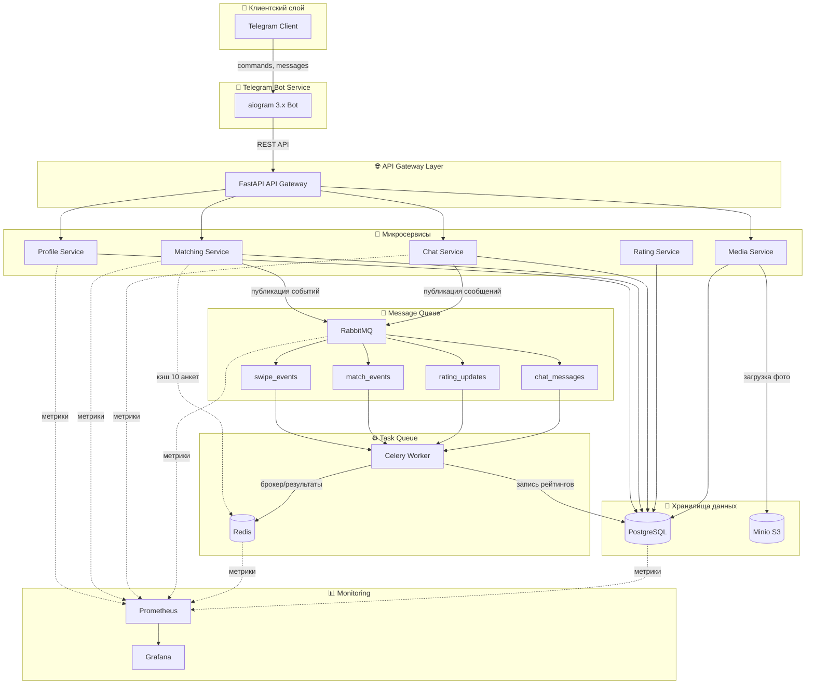

# ConnectMe — Архитектура системы

## Общая схема архитектуры

---

## Описание компонентов

### 1. Telegram Bot Service
- **Технология:** aiogram 3.x
- **Роль:** Единственный интерфейс для пользователей
- **Режим работы:** Long-polling или Webhook
- **Взаимодействие:** REST запросы к API Gateway

### 2. API Gateway (Backend API)
- **Технология:** FastAPI
- **Роль:** Единая точка входа, аутентификация, маршрутизация
- **Порт:** 8000
- **Взаимодействие:** Оркестрация запросов к микросервисам

### 3. Profile Service
- **Технология:** FastAPI + PostgreSQL
- **Роль:** CRUD профилей пользователей
- **Порт:** 8001
- **Данные:** users, profiles, photos

### 4. Matching Service
- **Технология:** FastAPI + Redis + PostgreSQL
- **Роль:** Подбор и ранжирование анкет, свайпы, мэтчи
- **Порт:** 8002
- **Кэширование:** 10 анкет на сессию в Redis
- **Данные:** swipes, matches

### 5. Chat Service
- **Технология:** FastAPI + WebSocket
- **Роль:** Обмен сообщениями между мэтчами
- **Порт:** 8003
- **Данные:** messages

### 6. Rating Service
- **Технология:** Celery 5.x + PostgreSQL
- **Роль:** Расчёт многоуровневых рейтингов (первичный, поведенческий, комбинированный)
- **Порт:** N/A (фоновые задачи)
- **Данные:** ratings_primary, ratings_behavioral, ratings_combined

### 7. Media Service
- **Технология:** FastAPI + Minio SDK
- **Роль:** Загрузка, валидация и хранение фотографий профилей
- **Порт:** 8004
- **Данные:** photos, bucket profile-photos

