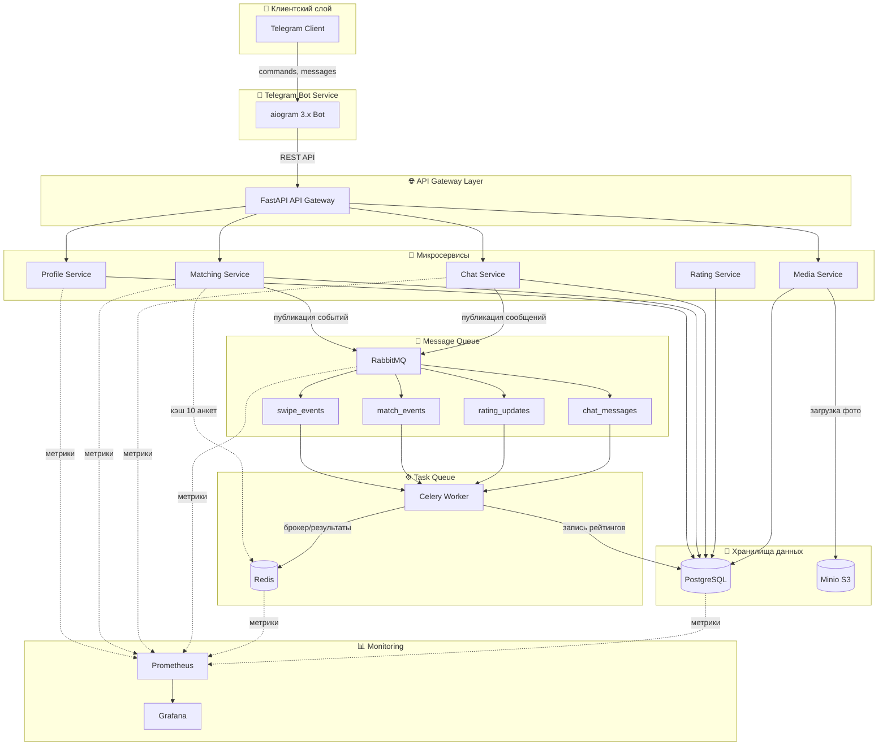
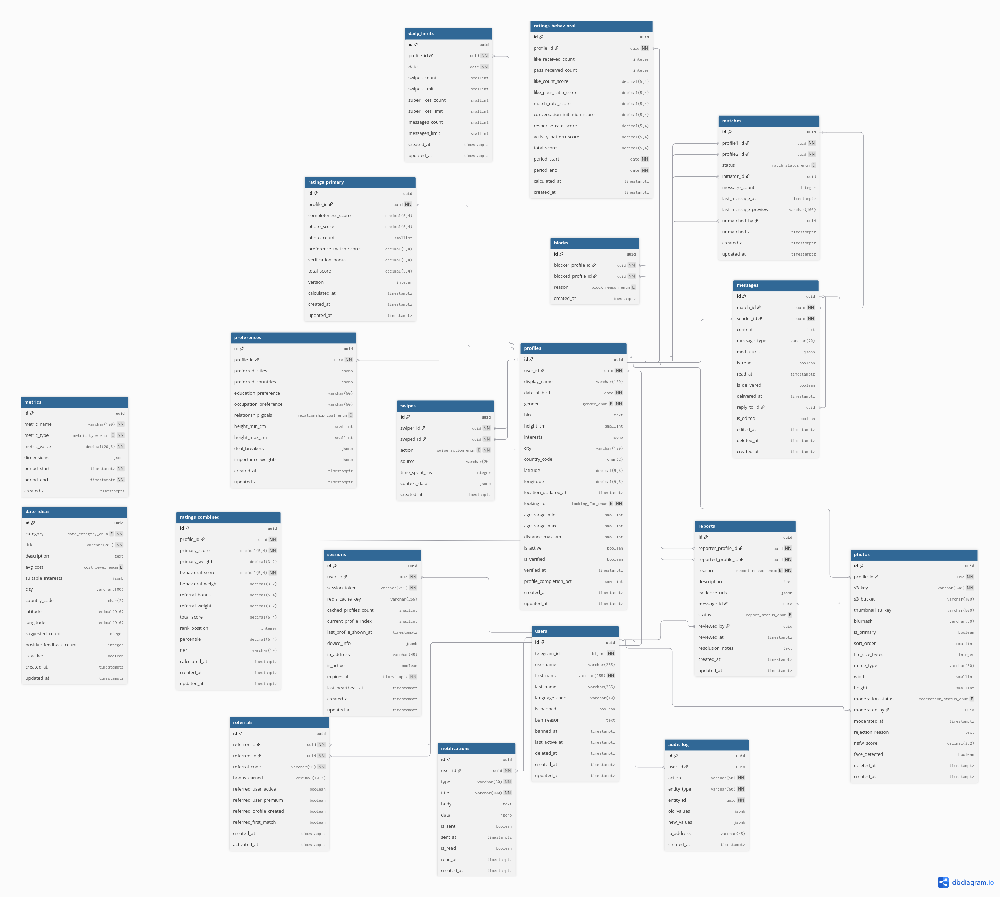

# Отчёт по Этапу 1: Планирование и проектирование

**Команда AI-агентов:** loveBot
**Дата завершения:** 2026-03-16
**Статус:** ✅ Завершено

---

## 📋 Содержание

1. [Описание сервисов](#1-описание-сервисов)
2. [Архитектура системы](#2-архитектура-системы)
3. [Схема базы данных](#3-схема-базы-данных)
4. [Заключение](#4-заключение)

---

## 1. Описание сервисов


### 1.1 Telegram Bot Service
**Назначение:** Основной интерфейс взаимодействия с пользователями через Telegram.

**Функции:**
- Приём и отправка сообщений, рендеринг inline-клавиатур
- Обработка медиа-контента (фотографии), управление сессиями
- Отправка уведомлений о мэтчах и сообщениях

**Технологии:** Python 3.11+, aiogram 3.x, aiohttp

---

### 1.2 Backend API (API Gateway)
**Назначение:** Единая точка входа для всех клиентских запросов, оркестрация сервисов.

**Функции:**
- Маршрутизация запросов, аутентификация и авторизация (по Telegram ID)
- Агрегация данных из нескольких сервисов, валидация входных данных
- Rate limiting, логирование запросов

**Технологии:** Python 3.11+, FastAPI, Pydantic, Uvicorn

**Порт:** `8000` (HTTP)

---

### 1.3 Profile Service
**Назначение:** Управление профилями пользователей (CRUD операции).

**Функции:**
- Создание/чтение/обновление/удаление профиля
- Управление интересами (JSONB), геолокация
- Проверка соответствия предпочтениям

**Технологии:** Python 3.11+, FastAPI, SQLAlchemy, PostgreSQL

**Порт:** `8001` (HTTP)

**Таблицы:** `users`, `profiles`, `photos`

---

### 1.4 Matching Service
**Назначение:** Алгоритмы подбора и ранжирования анкет, обработка свайпов.

**Функции:**
- Подбор анкет по фильтрам (пол, возраст, геолокация, предпочтения)
- Ранжирование по комбинированному рейтингу
- **Кэширование 10 анкет в Redis на сессию**
- Обработка лайков и пропусков, создание мэтчей при взаимных лайках
- Публикация событий в RabbitMQ

**Технологии:** Python 3.11+, FastAPI, Redis, PostgreSQL, RabbitMQ

**Порт:** `8002` (HTTP)

**Таблицы:** `swipes`, `matches`

---

### 1.5 Chat Service
**Назначение:** Обмен сообщениями между пользователями с активным мэтчем.

**Функции:**
- Статус прочтения сообщений, WebSocket для реального времени
- История переписки

**Технологии:** Python 3.11+, FastAPI, WebSockets, RabbitMQ

**Порт:** `8003` (HTTP + WebSocket)

**Таблицы:** `messages`

---

### 1.6 Rating Service
**Назначение:** Расчёт и обновление многоуровневых рейтингов пользователей.

**Функции:**
- **Первичный рейтинг:** полнота анкеты (30%), качество фото (30%), соответствие предпочтениям (20%), верификация (20%)
- **Поведенческий рейтинг:** количество лайков (25%), ratio лайков/пропусков (25%), частота мэтчей (20%), инициирование диалогов (15%), паттерны активности (15%)
- **Комбинированный рейтинг:** `combined = (primary * 0.4) + (behavioral * 0.4) + (referral_bonus * 0.2)`

**Технологии:** Python 3.11+, Celery, PostgreSQL, Redis

**Порт:** Не требуется (Celery worker)

**Таблицы:** `ratings_primary`, `ratings_behavioral`, `ratings_combined`

---


**Функции:**
- Хранение базы вопросов по категориям: `general`, `hobbies`, `travel`, `food`, `entertainment`, `deep`
- Уровни сложности: `light`, `medium`, `deep`
- Подбор случайного вопроса с учётом интересов, уровня сложности, частоты использования, success rate
- Отслеживание статистики использования, A/B тестирование

**Технологии:** Python 3.11+, FastAPI, PostgreSQL

**Порт:** `8004` (HTTP)


---

### 1.8 Media Service
**Назначение:** Загрузка, хранение и выдача медиа-контента.

**Функции:**
- Загрузка фотографий профилей, генерация превью
- Валидация формата и размера, управление бакетами Minio
- Генерация presigned URLs для доступа

**Технологии:** Python 3.11+, FastAPI, Minio SDK, Pillow

**Порт:** `8005` (HTTP)


---

### 1.9 PostgreSQL
**Назначение:** Основное хранилище структурированных данных.

**Функции:**
- Хранение всех сущностей, транзакционная целостность
- Гео-запросы (PostGIS), JSONB для гибких полей

**Технологии:** PostgreSQL 15+, PostGIS, pgBouncer

**Порт:** `5432`

---

### 1.10 Redis
**Назначение:** Кэширование и брокер для Celery.

**Функции:**
- Кэширование 10 анкет на сессию (`ranked_profiles:{user_id}:{session_id}`)
- Сессионные данные, rate limiting, брокер для Celery

**Технологии:** Redis 7+

**Порт:** `6379`

---

### 1.11 RabbitMQ
**Назначение:** Асинхронная обработка событий между сервисами.

**Exchanges:**
| Name | Type | Description |
|------|------|-------------|
| `swipe_events` | direct | События лайков и пропусков |
| `match_events` | direct | События создания мэтчей |
| `rating_updates` | fanout | События обновления рейтингов |
| `chat_messages` | direct | Сообщения чата |

**Порт:** `5672` (AMQP), `15672` (Management UI)

---

### 1.12 Celery Worker
**Назначение:** Фоновые и запланированные задачи.

**Расписание:**
- **Ежедневно:** `rating_recalculation`, `analytics_aggregation`
- **Ежечасно:** `cleanup_expired_sessions`

**Технологии:** Python 3.11+, Celery 5.x, Redis

---

### 1.13 Minio
**Назначение:** S3-совместимое объектное хранилище.

**Порт:** `9000` (API), `9001` (Console)

---

### 1.14 Metrics & Monitoring
**Назначение:** Сбор и визуализация метрик системы.


**Технологии:** Prometheus, Grafana

**Порты:** `9090` (Prometheus), `3000` (Grafana)

---

## 2. Архитектура системы

### 2.1 Схема архитектуры



---

### 2.2 Компоненты системы

| Компонент | Технология | Порт | Описание |
|-----------|------------|------|----------|
| Telegram Bot Service | aiogram 3.x | — | Интерфейс пользователя |
| API Gateway | FastAPI | 8000 | Маршрутизация запросов |
| Profile Service | FastAPI + PostgreSQL | 8001 | CRUD профилей |
| Matching Service | FastAPI + Redis | 8002 | Подбор и ранжирование |
| Chat Service | FastAPI + WebSocket | 8003 | Обмен сообщениями |
| Rating Service | Celery + PostgreSQL | — | Расчёт рейтингов |
| Media Service | FastAPI + Minio | 8005 | Хранение фото |
| PostgreSQL | PostgreSQL 15+ | 5432 | Основное хранилище |
| Redis | Redis 7+ | 6379 | Кэш и брокер Celery |
| RabbitMQ | RabbitMQ 3.12+ | 5672 | Очередь событий |
| Celery Worker | Celery 5.x | — | Фоновые задачи |
| Minio | Minio S3 | 9000 | Объектное хранилище |
| Prometheus | Prometheus | 9090 | Сбор метрик |
| Grafana | Grafana | 3000 | Визуализация |

---

### 2.3 Потоки данных

**Поток 1: Регистрация пользователя**
```
Telegram → Bot Service → API Gateway → Profile Service → PostgreSQL
                                                            ↓
                                                    Rating Service → PostgreSQL (создание рейтинга)
```

**Поток 2: Загрузка фотографии**
```
Telegram → Bot Service → API Gateway → Media Service → Minio
                                                        ↓
                                                Profile Service → PostgreSQL (метаданные)
                                                        ↓
                                                Rating Service → PostgreSQL (обновление photo_score)
```

**Поток 3: Подбор анкет (с кэшированием)**
```
Telegram → Bot Service → API Gateway → Matching Service → Redis (проверка кэша)
                                                            ↓ (cache miss)
                                                    PostgreSQL (запрос анкет)
                                                            ↓
                                                    Redis (запись 10 анкет)
                                                            ↓
                                                    Bot Service → Telegram (показ анкеты)
```

**Поток 4: Лайк анкеты**
```
Telegram → Bot Service → API Gateway → Matching Service → PostgreSQL (запись swipe)
                                                                ↓
                                                        RabbitMQ (swipe_events)
                                                                ↓
                                                        Celery Worker → Rating Service
                                                                ↓
                                                        PostgreSQL (обновление рейтинга)
```

**Поток 5: Создание мэтча**
```
Matching Service → PostgreSQL (проверка взаимного лайка)
                        ↓ (match found)
                    PostgreSQL (создание match)
                        ↓
                    RabbitMQ (match_events)
                        ↓
                    Celery Worker → Chat Service (создание чата)
                        ↓
                    Bot Service → Telegram (уведомление обоих пользователей)
```

**Поток 6: Отправка сообщения**
```
Telegram → Bot Service → API Gateway → Chat Service → PostgreSQL (сохранение)
                                                            ↓
                                                    RabbitMQ (chat_messages)
                                                            ↓
                                                    Bot Service → Telegram (доставка получателю)
                                                            ↓
                                                    PostgreSQL (запись usage)
                                                            ↓
                                                    Chat Service → PostgreSQL (сообщение)
                                                            ↓
                                                    Bot Service → Telegram (отправка)
```

**Поток 8: Ежедневный пересчёт рейтингов**
```
Celery Beat → Celery Worker → PostgreSQL (чтение свайпов, мэтчей)
                                    ↓
                                Rating Service (расчёт behavioral_score)
                                    ↓
                                PostgreSQL (обновление combined_score)
```


| Шаг | Описание |
|-----|----------|

**Категории вопросов:** `general`, `hobbies`, `travel`, `food`, `entertainment`, `deep`, `philosophical`, `funny`

**Уровни сложности:** `light` (лёгкие), `medium` (требуют размышления), `deep` (глубокие темы)

---

## 3. Схема базы данных

### 3.1 ER-диаграмма



См. полный файл: dbdiagram.dbml


---

### 3.2 Основные таблицы

| Таблица | Описание | Ключевые поля |
|---------|----------|---------------|
| `users` | Базовая сущность Telegram | `telegram_id`, `username`, `is_banned`, `deleted_at` |
| `profiles` | Расширенный профиль для знакомств | `date_of_birth`, `gender` (enum), `interests`, `location`, `looking_for` (enum) |
| `preferences` | Детальные предпочтения | `preferred_cities`, `relationship_goals` (enum), `importance_weights` |
| `photos` | Метаданные фотографий | `s3_key`, `moderation_status` (enum), `nsfw_score`, `face_detected` |
| `swipes` | История лайков/пропусков | `swiper_id`, `swiped_id`, `action` (enum), `source`, `time_spent_ms` |
| `matches` | Взаимные лайки | `profile1_id`, `profile2_id`, `status` (enum), `message_count` |
| `messages` | Сообщения в чате | `match_id`, `sender_id`, `content`, `message_type`, `is_delivered` |
| `reports` | Жалобы на модерацию | `reporter_profile_id`, `reported_profile_id`, `reason` (enum), `status` |
| `blocks` | Блокировки пользователей | `blocker_profile_id`, `blocked_profile_id`, `reason` |
| `ratings_primary` | Первичный рейтинг анкеты | `completeness_score`, `photo_score`, `photo_count`, `total_score` |
| `ratings_behavioral` | Поведенческий рейтинг | `like_received_count`, `like_count_score`, `response_rate_score`, `total_score` |
| `ratings_combined` | Комбинированный рейтинг | `primary_score`, `behavioral_score`, `tier`, `rank_position` |
| `referrals` | Реферальная программа | `referrer_id`, `referred_id`, `referral_code`, `referred_first_match` |
| `sessions` | Сессии пользователей | `user_id`, `session_token`, `device_info`, `expires_at` |
| `daily_limits` | Rate limiting | `profile_id`, `date`, `swipes_count`, `swipes_limit` |
| `notifications` | Уведомления | `user_id`, `type`, `title`, `is_read` |
| `metrics` | Агрегированные метрики | `metric_name`, `metric_type` (enum), `metric_value`, `dimensions` |
| `date_ideas` | Идеи для свиданий | `category` (enum), `title`, `avg_cost` (enum), `suggested_count` |
| `audit_log` | Лог аудита | `user_id`, `action`, `entity_type`, `old_values`, `new_values` |

---

### 3.3 Система ранжирования

**Уровень 1: Первичный рейтинг** (пересчитывается при обновлении профиля)

| Фактор | Вес | Описание |
|--------|-----|----------|
| `completeness_score` | 30% | Полнота заполнения анкеты |
| `photo_score` | 30% | Количество и качество фотографий |
| `preference_match` | 20% | Соответствие предпочтениям |
| `verification_bonus` | 20% | Бонус за верификацию |

**Уровень 2: Поведенческий рейтинг** (пересчитывается ежедневно через Celery)

| Фактор | Вес | Описание |
|--------|-----|----------|
| `like_count` | 25% | Количество полученных лайков |
| `like_pass_ratio` | 25% | Соотношение лайков и пропусков |
| `match_rate` | 20% | Частота взаимных лайков |
| `conversation_initiation` | 15% | Частота инициирования диалогов |
| `activity_pattern` | 15% | Временные паттерны активности |

**Уровень 3: Комбинированный рейтинг** (пересчитывается ежедневно)

```
combined = (primary * 0.4) + (behavioral * 0.4) + (referral_bonus * 0.2)
```

---

### 3.4 Redis-структуры

**Кэширование 10 анкет на сессию:**

| Ключ | Тип | Описание | TTL |
|------|-----|----------|-----|
| `ranked_profiles:{user_id}:{session_id}` | LIST | Кэш отранжированных анкет | 3600 сек |
| `session:{telegram_id}` | HASH | Данные сессии | 3600 сек |
| `ratelimit:{telegram_id}:{action}` | COUNTER | Rate limiting | 60 сек |

**Структура кэша анкет:**
```json
[
  {
    "profile_id": "uuid",
    "age": 25,
    "gender": "female",
    "city": "Moscow",
    "interests": ["travel", "music"],
    "combined_score": 0.85,
    "distance_km": 5.2
  }
  // ... ещё 9 анкет
]
```

**Стратегия обновления:** На последней анкете круг повторяется — загружаются новые 10 анкет.

---

## 4. Заключение

### Выполненные задачи Этапа 1:

| № | Задача | Исполнитель | Статус | Артефакт |
|---|--------|-------------|--------|----------|
| 1.1 | Сбор требований | Product Manager | ✅ | `prd.json` |
| 1.2 | Проектирование архитектуры | System Architect | ✅ | `architecture.md`, `services.md` |
| 1.3 | Создание схемы БД | Database Designer | ✅ | `database_schema.md`, `dbdiagram.dbml` |
| 1.4 | Создание сводного отчёта | Technical Writer | ✅ | `stage1_report.md` |

---

### Соответствие требованиям преподавателя:

| Требование | Статус | Где реализовано |
|------------|--------|-----------------|
| Описание сервисов | ✅ | Раздел 1 (14 сервисов) |
| Архитектура + схема | ✅ | Раздел 2 (Mermaid-диаграмма) |
| Схема данных в БД | ✅ | Раздел 3 (DBML для dbdiagram.io) |

---

### Готовность к Этапу 2:

Система готова к переходу к **Этапу 2: Разработка базовой функциональности**.

**Следующие шаги:**
1. Настройка инфраструктуры (Docker Compose для PostgreSQL, Redis, RabbitMQ, Minio)
2. Разработка Telegram Bot Service на aiogram 3.x
3. Реализация команды `/start` и базового интерфейса
4. Интеграция с Backend API

---

*Документ создан автономной системой loveBot для проекта ConnectMe.*
