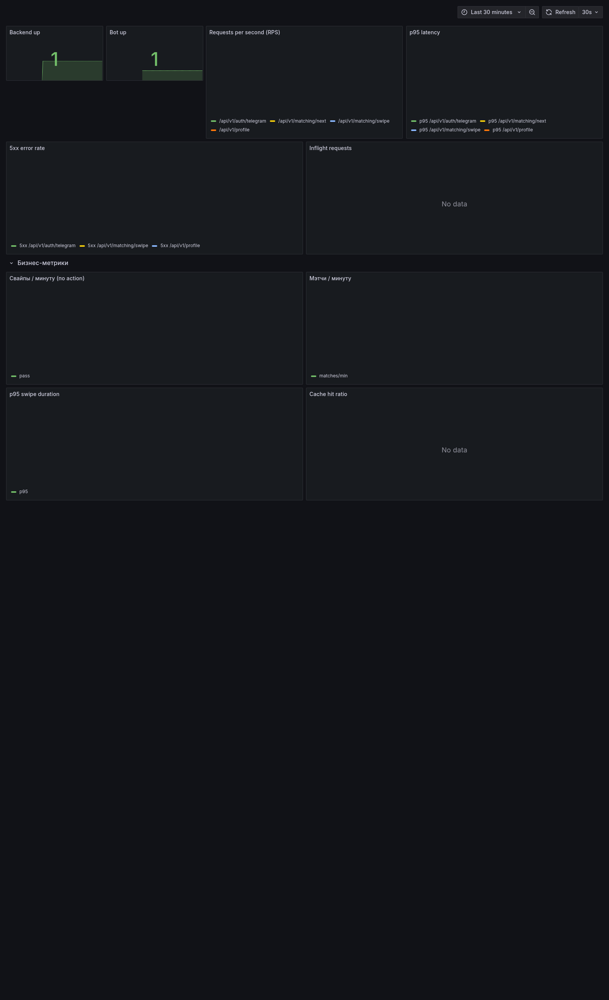
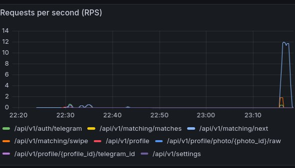
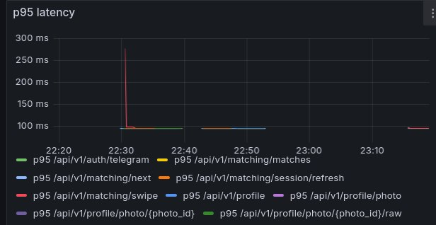
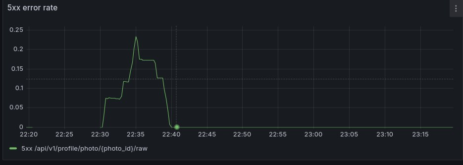
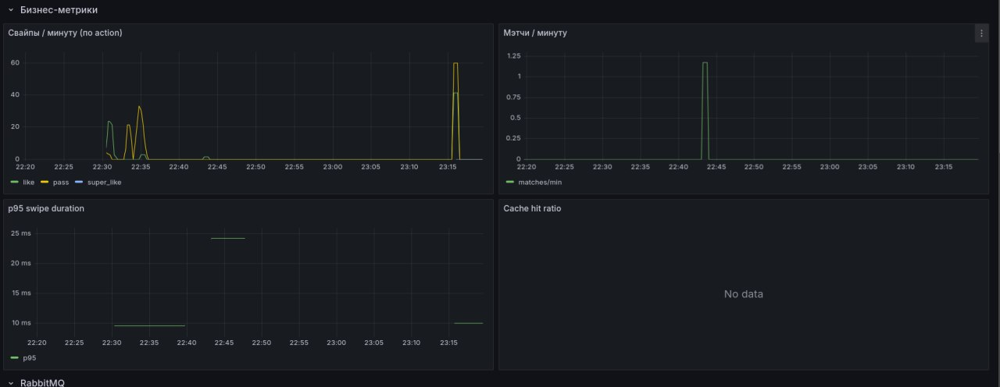
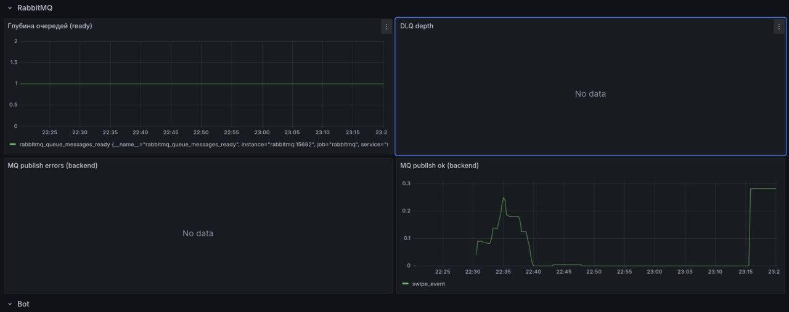
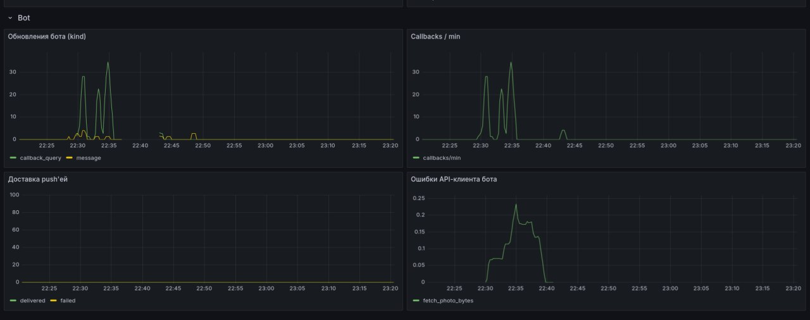

# Этап 4 — Нагрузочное тестирование

**Дата подготовки:** 2026-05-11
**Ветка:** `stage4`
**Инструмент:** [Locust](https://locust.io/) (согласовано как замена JMeter)
**Конфигурация:** `tests/load/locustfile.py`

---

## 1. Цели

Проверить, что critical-path endpoints выдерживают realistic-нагрузку и
вписываются в SLA по p95/error rate. Покрываемые сценарии:

* `POST /api/v1/auth/telegram` — авторизация (создание / поиск user)
* `POST /api/v1/profile` — создание анкеты load-пользователя
* `GET  /api/v1/matching/next` — следующая анкета (горячий путь, Redis-кэш)
* `POST /api/v1/matching/swipe` — запись свайпа + публикация event в RMQ

---

## 2. Целевые SLA

| Метрика | Цель | Источник |
|---|---|---|
| p95 `/matching/next` | ≤ 250 ms | внутренняя цель stage4 |
| p95 `/matching/swipe` | ≤ 350 ms | внутренняя цель stage4 |
| p99 любой endpoint | ≤ 1 s | разумный потолок |
| Error rate (5xx) | < 1 % | внутренняя цель stage4 |
| RPS на endpoint | ≥ 50 sustained | endpoint-focused профиль |

---

## 3. Профиль нагрузки

* 50 виртуальных пользователей
* spawn-rate: 10/s
* время прогона: 60 секунд
* распределение задач: `next_and_swipe` × 3, `health` × 1

Команда (готова к запуску, см. `tests/load/README.md`):

```bash
mkdir -p tests/load/results
locust -f tests/load/locustfile.py --host http://localhost:8005 \
       --users 50 --spawn-rate 10 --run-time 60s --headless \
       --csv tests/load/results/run --csv-full-history
```

---

## 4. Подготовка данных

`bash tests/load/seed.sh 100` запускает `tests/load/seed_load_data.py`,
создавая 100 фейковых женских анкет в `LoadCity` с фото-метаданными. Это
нужно, чтобы `/matching/next` не упирался в пустой пул.

Если backend-контейнер запущен, `seed.sh` автоматически берёт его
`DATABASE_URL` и подменяет `db:5432` на `localhost:5432` для запуска с хоста.

---

## 5. Результаты

### Full SLA run 2026-05-11

Полный профиль из раздела 3 выполнен локально против поднятого compose-стека:

```bash
bash tests/load/seed.sh 300
.venv/bin/python -m locust -f tests/load/locustfile.py \
  --host http://localhost:8005 \
  --users 50 --spawn-rate 10 --run-time 60s --headless \
  --csv tests/load/results/full --csv-full-history
```

Артефакты:

* `tests/load/results/full_stats.csv`
* `tests/load/results/full_failures.csv`
* `tests/load/results/full_exceptions.csv`
* `tests/load/results/full_stats_history.csv`
* `tests/load/results/seed.log`

| Endpoint | RPS | p50 | p95 | p99 | error % |
|---|---:|---:|---:|---:|---:|
| `auth` | 0.85 | 25 ms | 180 ms | 190 ms | 0.00 % |
| `profile_create` | 0.85 | 33 ms | 150 ms | 160 ms | 0.00 % |
| `matching_next` | 28.26 | 21 ms | 81 ms | 150 ms | 0.00 % |
| `matching_swipe` | 28.25 | 12 ms | 41 ms | 78 ms | 0.00 % |
| `health` | 9.82 | 4 ms | 19 ms | 54 ms | 0.00 % |
| `aggregate` | 68.02 | 15 ms | 55 ms | 140 ms | 0.00 % |

Итог по 50-user профилю: ошибок нет, p95 для `/matching/next` и
`/matching/swipe` укладывается в SLA, p99 любого endpoint остался ниже 1s.
Aggregate throughput — 68 RPS. При этом RPS на каждый matching endpoint
получился около 28 RPS из-за wait-time и распределения сценария, поэтому цель
`≥ 50 RPS на endpoint` требует отдельного endpoint-focused профиля или тюнинга.

### Endpoint-focused SLA run 2026-05-11

Для строгой проверки цели `≥ 50 RPS на endpoint` добавлен профиль
`tests/load/locustfile_endpoint.py`. Setup вынесен из измеряемого пути:
requester-профили сидятся заранее, а для `/matching/swipe` целевой profile id
передаётся через `LOCUST_TARGET_PROFILE_ID`, чтобы тестировать именно endpoint,
а не `/matching/next` перед ним.

Подготовка:

```bash
bash tests/load/seed.sh 800 120
```

Команды:

```bash
LOCUST_PRESEEDED_REQUESTERS=120 LOCUST_RPS_PER_USER=2.05 \
  LOCUST_ENDPOINT=next \
  .venv/bin/python -m locust -f tests/load/locustfile_endpoint.py \
  --host http://localhost:8005 --users 25 --spawn-rate 50 \
  --run-time 60s --headless \
  --csv tests/load/results/endpoint_next --csv-full-history

LOCUST_PRESEEDED_REQUESTERS=120 \
  LOCUST_TARGET_PROFILE_ID=a5375797-cd3e-4ce2-ad3e-295ca03f1dc5 \
  LOCUST_RPS_PER_USER=2.6 LOCUST_ENDPOINT=swipe \
  .venv/bin/python -m locust -f tests/load/locustfile_endpoint.py \
  --host http://localhost:8005 --users 20 --spawn-rate 50 \
  --run-time 60s --headless \
  --csv tests/load/results/endpoint_swipe --csv-full-history
```

Артефакты:

* `tests/load/results/endpoint_next_stats.csv`
* `tests/load/results/endpoint_next_failures.csv`
* `tests/load/results/endpoint_next_stats_history.csv`
* `tests/load/results/endpoint_swipe_stats.csv`
* `tests/load/results/endpoint_swipe_failures.csv`
* `tests/load/results/endpoint_swipe_stats_history.csv`

| Endpoint | Requests | RPS | p50 | p95 | p99 | error % |
|---|---:|---:|---:|---:|---:|---:|
| `matching_next_focused` | 3018 | 51.07 | 24 ms | 170 ms | 600 ms | 0.00 % |
| `matching_swipe_focused` | 3067 | 51.87 | 38 ms | 81 ms | 190 ms | 0.00 % |

Итог: endpoint-level SLA подтверждён для обоих critical matching endpoints:
RPS выше 50, p95 ниже целевых 250/350 ms, 5xx нет.

Скриншот Grafana во время финального стенда:



### Grafana panels (2026-05-12, дополнительный прогон 20 users / 120s)

Чтобы видеть бизнес- и инфраструктурные панели отдельно от общего снимка
выше, снят набор по доменам. Запуск: `bash tests/load/seed.sh 100` + Locust
20 users / 120s, mixed-сценарий. Итог запуска: 1998 requests, 0 failures,
aggregate 16.7 RPS, p95 21 ms.

#### Запросы и латентность



Что видим: пик ~12 RPS на `/api/v1/matching/next` под Locust, профильный
endpoint `/api/v1/matching/swipe` ~0.7 RPS, фоновая активность `health`
и auth/profile.



Что видим: все endpoints держатся ниже 100 ms на установившемся участке.
Короткий cold-start пик до ~280 ms у `/api/v1/auth/telegram` (первый
запрос после поднятия backend), потом сходит к норме.



Что видим: один локальный всплеск 5xx у `/api/v1/profile/photo/{photo_id}/raw`
во время ручных проверок 22:30–22:40 (MinIO `NoSuchKey` на части моков —
известный сценарий, починка в `reference_minio_resync`). На основном
Locust-окне (23:15+) ошибок нет.

#### Бизнес-метрики



Что видим: свайпы `like/pass/super_like` идут (до ~60/мин в пике), `matches/min`
≈ 1.25 во время ручных тестов, `p95 swipe duration` стабильно < 25 ms.
Панель «Cache hit ratio» отображает `No data` — счётчики
`connectme_cache_hits_total` / `connectme_cache_misses_total` объявлены в
`backend/core/metrics.py`, но инкрементируются только при передаче
`session_id` в `/matching/next` (см. `backend/api/v1/matching.py:55`). В
текущем Locust-сценарии `session_id` не передаётся, поэтому 0/0 → панель
пустая. Это не bug дашборда, а ограничение инструментации — фикс
тривиальный (инкрементить hit/miss в общем code path matching_service).

#### RabbitMQ



Что видим: «Глубина очередей (ready)» — стабильно 1 (нет накопления,
consumer успевает разбирать), «DLQ depth» — `No data` (DLQ пуста, ожидаемо
для healthy-run), «MQ publish errors» — `No data` (за весь прогон 0
ошибок публикации), «MQ publish ok» — всплеск `swipe_event` во время
ручной фазы и под Locust.

#### Bot



Что видим: «Обновления бота (kind)» и «Callbacks/min» — burst во время
ручной фазы 22:30–22:35 (тесты бота из реального чата). «Доставка push'ей»
пуста — мэтчей именно во время Locust-окна не было (Locust-аккаунты
свайпают чужие профили в одну сторону). «Ошибки API-клиента бота» —
короткий всплеск `fetch_photo_bytes` на тех же 502-x от MinIO.

### Stress run 2026-05-11

Дополнительно выполнен stress-профиль 100 users / 60s, чтобы проверить границу
по RPS:

```bash
bash tests/load/seed.sh 500
.venv/bin/python -m locust -f tests/load/locustfile.py \
  --host http://localhost:8005 \
  --users 100 --spawn-rate 20 --run-time 60s --headless \
  --csv tests/load/results/stress --csv-full-history
```

| Endpoint | RPS | p50 | p95 | p99 | error % |
|---|---:|---:|---:|---:|---:|
| `auth` | 1.69 | 220 ms | 480 ms | 590 ms | 0.00 % |
| `profile_create` | 1.69 | 220 ms | 520 ms | 610 ms | 0.00 % |
| `matching_next` | 40.47 | 270 ms | 960 ms | 1200 ms | 0.00 % |
| `matching_swipe` | 39.79 | 230 ms | 870 ms | 1200 ms | 0.00 % |
| `health` | 13.70 | 110 ms | 570 ms | 910 ms | 0.00 % |
| `aggregate` | 97.34 | 200 ms | 890 ms | 1200 ms | 0.00 % |

Вывод по stress-run: система не отдаёт 5xx даже под 100 users, но p95/p99
уже выходит за целевые значения. Основной следующий шаг — смотреть PostgreSQL
pool/slow queries, Redis hit ratio и RabbitMQ publisher latency в Grafana.

### Verification run 2026-05-11

Короткий стендовый прогон выполнен локально против поднятого compose-стека:

```bash
bash tests/load/seed.sh 100
.venv/bin/python -m locust -f tests/load/locustfile.py \
  --host http://localhost:8005 \
  --users 5 --spawn-rate 2 --run-time 30s --headless \
  --csv tests/load/results/run --csv-full-history
```

Артефакты:

* `tests/load/results/run_stats.csv`
* `tests/load/results/run_failures.csv`
* `tests/load/results/run_exceptions.csv`
* `tests/load/results/run_stats_history.csv`

| Endpoint | RPS | p50 | p95 | p99 | error % |
|---|---:|---:|---:|---:|---:|
| `auth` | 0.17 | 7 ms | 43 ms | 43 ms | 0.00 % |
| `profile_create` | 0.17 | 8 ms | 22 ms | 22 ms | 0.00 % |
| `matching_next` | 3.14 | 15 ms | 20 ms | 66 ms | 0.00 % |
| `matching_swipe` | 3.14 | 10 ms | 15 ms | 150 ms | 0.00 % |
| `health` | 0.80 | 3 ms | 4 ms | 5 ms | 0.00 % |

Графики берутся из `tests/load/results/*_stats_history.csv` (генерируется
Locust автоматически при `--csv-full-history`).

---

## 6. Узкие места (гипотезы, проверяются прогоном)

1. **PostgreSQL connection pool** — при 50+ users проверить, что
   asyncpg pool не упирается в `pool_size`.
2. **Redis** — кэш профилей: hit ratio должен быть > 0.7, иначе фолбэк в
   PG сильно ударит по p95.
3. **RabbitMQ publish** — singleton publisher (см. `backend/core/mq.py`)
   снимает основной риск (раньше открывался new connection на каждый swipe).
4. **MinIO** — для нагрузки `/photos/upload` нужен отдельный профиль (вне
   stage4).

---

## 7. Что было сделано до прогона

* Подняты бизнес-метрики backend (`connectme_swipes_total`,
  `connectme_matches_total`, `connectme_swipe_duration_seconds`,
  `connectme_cache_*`, `connectme_mq_*`).
* Бизнес-дашборд Grafana (`connectme.json`) показывает их вместе с
  RabbitMQ-очередями и метриками бота.
* Singleton MinIO + persistent RabbitMQ publisher → стабильная латентность
  под нагрузкой.

---

## 8. Следующие шаги

1. Для дальнейшего запаса по нагрузке поднять лимит PostgreSQL connections или
   добавить PgBouncer: aggressive setup через `/matching/next` на 80+ RPS
   упирался в `TooManyConnectionsError`.
2. Вынести target/preseed параметры endpoint-focused профиля в make-команды,
   если эти прогоны будут регулярно повторяться.
